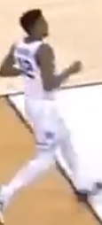
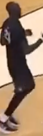

# nba-automation
This notebook contains my final project for the Metis Data Science Bootcamp
Using a custom trained neural network as it's base, I built out a system to automate basketball highlight reels from real broadcast footage. 
Before going any further I need to shoutout two repos who I built off of a lot.

For the custom object training I referenced and built off of [this colab notebook](https://colab.research.google.com/drive/1Mh2HP_Mfxoao6qNFbhfV3u28tG8jAVGk). That notebook is explained in [this video](https://www.youtube.com/watch?v=10joRJt39Ns&feature=emb_logo&ab_channel=TheAIGuy). The AI Guy is an awesome resource and fast tracked my understanding of YOLO Object Detection and the Darknet Framework. 

For Object Tracking, I built off of a framework set up [here](https://github.com/pythonlessons/TensorFlow-2.x-YOLOv3/blob/master/yolov3/utils.py). Again, having this notebook really sped up my ability to impliment the player tracking feature.

The final presntation slides are located [here]().

## Project Goal
Create a basic, inexpensive, alternative for cutting up game film and extracting important game information.

## Data
To train my custom model, I screenshotted over 900 images from basketball games on youtube and labelled the basketball as well as "made baskets" using [labelimg](https://github.com/tzutalin/labelImg). This was all the data I used for the training of my model.

## Process and code

The first step was to train a [YOLO](https://pjreddie.com/darknet/yolo/) object detection model on my custom classes which were a basketball and made baskets. That training code is in the [baskbetball-trainer notebook](baskbetball-trainer.ipynb). My weights file were too big for github, so unfortunately I can't share the custom weights I created here.

Here is what that detector can pick up in an image. 

Basketball Detection       |  Made Basket Detection
:-------------------------:|:-------------------------:
  |  

I then used pretrained weights for the player detection, and built off of the Deep Sort framework to actually track the players. All of the tracking code is found in the [deep_sort directory](./deep_sort). Tracking vs Detection is an important distinction. Tracking allows for me to connect player detections over a series of frames so I can assign features to them. In essence the model is remembering each player frame over frame.

Here is what player tracking looks like, notice each player maintains there "id" throughout the clip:

[Here](deep_sort/color_detect.py) I used openCV to extract the ratio of light pixels vs total pixels in each players bounding box. By keeping a running average of this ratio Im able to identify the team the player is on. 

Light Team                 |  Dark Team
:-------------------------:|:-------------------------:
  |   
Ratio= .03 | Ratio = .35

Putting it all together the video processing is done in the [object_tracker file](object_tracker.py). 

The video analyzation will return a list of "made basket" frames. With that we can use the [slice_video file](slice_video.py) to obtain a "highlight reel".

This whole process from raw video to highlight reel is shown in the [DeepSort notebook](DeepSort.ipynb. 

## Biggest Challenge

Obtaining the "data" is a very time intensive process of screenshotting frames of a broadcast then going through and labelling each one. I captured about 900 images from 5 different games. Ideally I would have more images from more games. This would greatly improve my predictions on new games, and limit the False Positive "made baskets".

The player tracking proved to be the most diffucult aspect of this problem. With players contantly moving infront, behind, and around eachother, tracking an individual player for a prolonged period of time is difficult. For future work I would try to harness the player numbers to enhance my models tracking abilities.

## Technologies/Programs used
- Yolo
- TensorFlow
- OpenCV
- DeepSort
- Darknet
- Python
